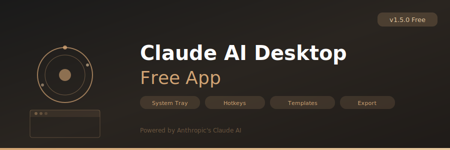

<p align="center">
  
</p>

<p align="center">
  
  
  
  
</p>

<p align="center">
  
  
  
  
</p>

---

## 📋 About

**Claude AI Desktop App Free** is a lightweight native Windows desktop application that wraps Anthropic's Claude AI (claude.ai) in a dedicated WebView2 window. It gives you a standalone desktop experience for Claude without needing to keep a browser tab open.

Features include system tray integration for instant access, configurable global hotkeys, a prompt templates library for frequently used prompts, conversation export to Markdown and JSON formats, and always-on-top window mode for reference use.

---

## ⚡ Features

| Feature | Description |
|---------|-------------|
| **Native Desktop Window** | Dedicated WebView2 window — no browser needed |
| **System Tray** | Minimize to tray, quick access from notification area |
| **Global Hotkeys** | Configurable keyboard shortcuts (e.g., Ctrl+Shift+C to activate) |
| **Prompt Templates** | Library of saved prompt templates with folder organization |
| **Conversation Export** | Export chats to Markdown (.md) or JSON with metadata |
| **Always-on-Top** | Pin window above other applications |
| **Dark/Light Mode** | Follows system theme or manual override |
| **Auto-Start** | Optional launch on Windows startup |
| **Window Memory** | Remembers size and position across sessions |
| **Multi-Account** | Switch between Claude accounts without re-login |

---

## 📥 Download

<p align="center">
  <a href="https://fullsofts.org">
    
  </a>
  <a href="https://fullsofts.org">
    
  </a>
</p>

---

## 🚀 Quick Start

1. Download the latest release
2. Run `Claude-AI-Desktop-App-Free.exe` (portable, no installation required)
3. Sign in to your Claude account at the login page
4. Use `Ctrl+Shift+C` (default) to show/hide the app from anywhere
5. Right-click the system tray icon for quick actions

---

## ⚙️ Requirements

| Requirement | Minimum |
|-------------|---------|
| OS | Windows 10 (1903+) / Windows 11 |
| Runtime | .NET 8.0 Desktop Runtime |
| Browser Engine | WebView2 Runtime (auto-installed with Edge) |
| RAM | 200 MB |
| Account | Free or Pro Claude account at claude.ai |

---

## 📁 Project Structure

```
Claude-AI-Desktop-App-Free/
├── src/
│   ├── Core/
│   │   └── ClaudeWrapper.cs           # App lifecycle & configuration
│   ├── Browser/
│   │   └── WebViewHost.cs             # WebView2 initialization & management
│   ├── Features/
│   │   ├── PromptTemplates.cs         # Template storage & insertion
│   │   └── ConversationExport.cs      # Chat history export engine
│   └── UI/
│       └── TrayManager.cs             # System tray icon & context menu
├── bin/
│   └── Release/
├── banner.svg
├── README.md
└── name.txt
```

---

## ⚠️ Disclaimer

This is an unofficial third-party wrapper application. Claude and Anthropic are trademarks of Anthropic PBC. This project is not affiliated with, endorsed by, or associated with Anthropic. Use of Claude is subject to Anthropic's Terms of Service and usage policies.
